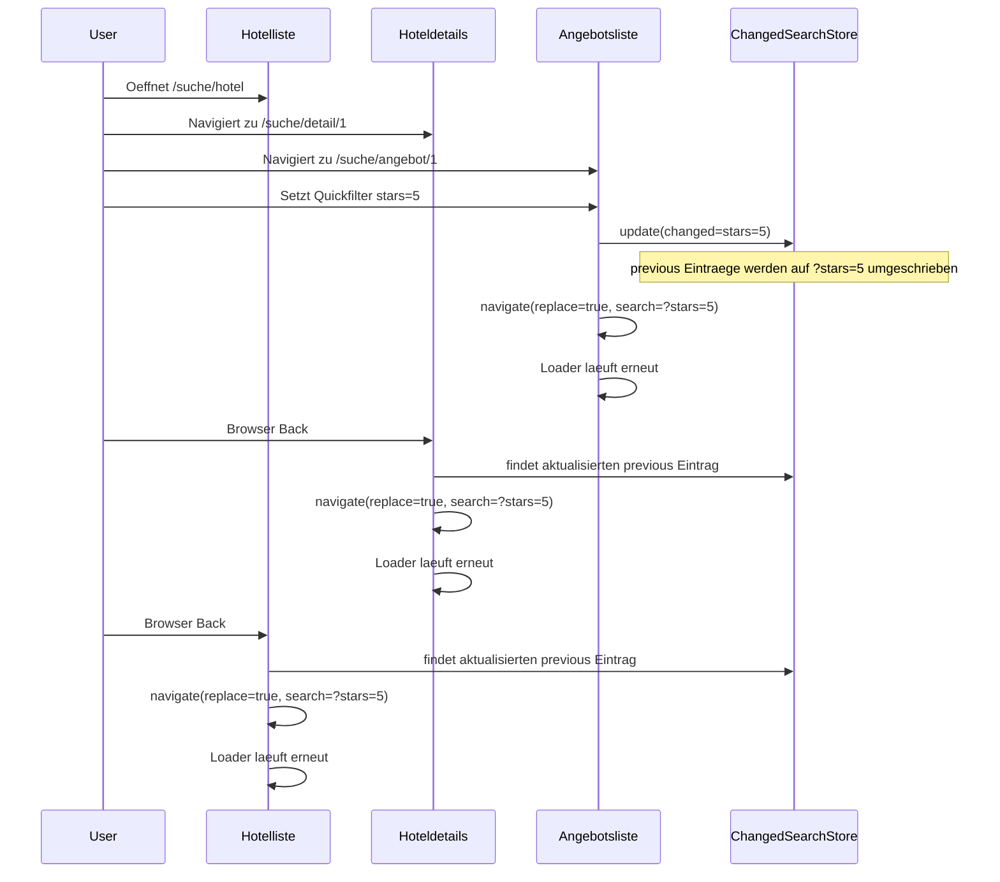

# WebApp Demo Projekt -- Eigenstaendiger Implementierungsplan

> Dieses Dokument ist ein vollstaendiger, eigenstaendiger Plan. Er setzt KEIN Wissen ueber andere Projekte voraus. Alle Algorithmen, Konfigurationen und Vertraege sind hier beschrieben.

## Voraussetzungen (Host-System: macOS)

- **Node.js** >= 20 LTS
- **pnpm** >= 9 (`npm i -g pnpm`)
- **Docker Desktop** (fuer macOS)
- **Xcode** >= 16 (fuer iOS Simulator + SwiftUI)
- **Homebrew** (`brew`)
- **mkcert** (`brew install mkcert`) -- wird vom Start-Script automatisch installiert

---

## Projektstruktur

```
webapp-demo/                         # Wurzelverzeichnis (= CWD fuer alle Befehle)
├── webapp/                          # React Router WebApp (SSR)
│   ├── app/
│   │   ├── routes.ts                # Route-Manifest (React Router 7)
│   │   ├── root.tsx
│   │   ├── entry.client.tsx         # Client-Bootstrap: i18n + ViewTransitions + HistoryBus + Bridge
│   │   ├── tailwind.css
│   │   ├── routes/
│   │   │   ├── index.tsx
│   │   │   ├── suche.hotel.tsx
│   │   │   ├── suche.detail.$id.tsx
│   │   │   ├── suche.angebot.$hotelId.tsx
│   │   │   ├── buchung.tsx
│   │   │   ├── api.hotels.ts
│   │   │   ├── api.offers.$hotelId.ts
│   │   │   ├── api.locales.$lng.$ns.ts
│   │   │   └── health.ts
│   │   ├── components/
│   │   │   ├── quickfilter.tsx
│   │   │   ├── hotel_card.tsx
│   │   │   ├── offer_card.tsx
│   │   │   └── app_shell.tsx
│   │   ├── hooks/
│   │   │   └── use_changed_search.ts
│   │   ├── stores/
│   │   │   ├── changed_search.ts
│   │   │   ├── view_transition.ts
│   │   │   └── app_header.ts
│   │   ├── utility/
│   │   │   ├── native_app/
│   │   │   │   └── bridge.ts
│   │   │   ├── history_bus.ts
│   │   │   ├── view_transitions.ts
│   │   │   └── mock_data.ts
│   │   ├── locales/
│   │   │   ├── de/translation.json
│   │   │   └── en/translation.json
│   │   ├── config/
│   │   │   └── search_param.ts
│   │   └── types/
│   │       ├── app_history.ts
│   │       └── hotel.ts
│   ├── server/
│   │   ├── index.ts
│   │   └── i18n.server.ts
│   ├── tailwind.config.ts
│   ├── vite.config.ts
│   ├── react-router.config.ts
│   ├── tsconfig.json
│   ├── package.json
│   └── declaration.d.ts
│
├── ios/
│   └── WebAppDemo/
│       ├── WebAppDemo.xcodeproj/
│       │   └── project.pbxproj
│       └── WebAppDemo/
│           ├── WebAppDemoApp.swift
│           ├── MainTabView.swift
│           ├── WebViewTab/
│           │   ├── WebViewScreen.swift
│           │   ├── WebViewContainerViewController.swift
│           │   ├── WebViewContainerRepresentable.swift
│           │   ├── BridgeHandler.swift
│           │   └── HeaderState.swift
│           ├── SettingsTab/
│           │   └── SettingsScreen.swift
│           └── InfoTab/
│               └── InfoScreen.swift
│
├── .docker/
│   ├── webapp/
│   │   ├── Dockerfile
│   │   └── rootfs/usr/local/bin/entrypoint.sh
│   └── nginx/
│       ├── Dockerfile
│       └── rootfs/etc/nginx/
│           ├── nginx.conf
│           ├── conf.d/proxy.conf
│           └── sites-enabled/local.conf
│
├── .dev/
│   ├── start.sh
│   ├── stop.sh
│   ├── prepare.sh
│   ├── get_ids.sh
│   ├── get_network_ips.sh
│   └── local_certificates.sh
│
├── docker-compose.yml
├── .dockerignore
├── Makefile
└── README.md
```

---

# KERNPUNKT 1: React-Router WebApp (SSR)

## 1.1 Dependencies (`webapp/package.json`)

```json
{
  "name": "webapp-demo",
  "private": true,
  "type": "module",
  "scripts": {
    "dev": "node --import tsx server/index.ts",
    "build": "react-router build",
    "start": "NODE_ENV=production node build/server/index.js",
    "typecheck": "react-router typegen && tsc",
    "typegen": "react-router typegen"
  },
  "dependencies": {
    "react": "^19.0.0",
    "react-dom": "^19.0.0",
    "react-router": "^7.0.0",
    "@react-router/express": "^7.0.0",
    "@react-router/node": "^7.0.0",
    "express": "^5.0.0",
    "compression": "^1.7.0",
    "i18next": "^24.0.0",
    "react-i18next": "^15.0.0",
    "remix-i18next": "^7.0.0",
    "i18next-browser-languagedetector": "^8.0.0",
    "i18next-fs-backend": "^2.0.0",
    "i18next-http-backend": "^3.0.0",
    "zustand": "^5.0.0",
    "@tanstack/react-virtual": "^3.0.0",
    "accept-language-parser": "^1.5.0"
  },
  "devDependencies": {
    "@react-router/dev": "^7.0.0",
    "@tailwindcss/vite": "^4.0.0",
    "tailwindcss": "^4.0.0",
    "vite": "^6.0.0",
    "vite-tsconfig-paths": "^4.0.0",
    "tsx": "^4.0.0",
    "typescript": "^5.7.0",
    "@types/react": "^19.0.0",
    "@types/react-dom": "^19.0.0",
    "@types/express": "^5.0.0",
    "@types/compression": "^1.7.0",
    "@types/accept-language-parser": "^1.5.0"
  }
}
```

Installieren mit: `cd webapp && pnpm install`

> **Hinweis:** Bei der Installation `pnpm install` verwenden, NICHT `npm`. Die exakten Minor-Versionen werden von pnpm aufgeloest. Falls eine Version nicht existiert (z.B. Vite 7 vs 6), die aktuell verfuegbare LTS-Version verwenden und react-router docs pruefen.

## 1.2 Route-Manifest (`webapp/app/routes.ts`)

React Router 7 Framework Mode erfordert eine `routes.ts` Datei die alle Routen registriert:

```typescript
import { index, route, prefix, type RouteConfig } from "@react-router/dev/routes";

export default [
  index("routes/index.tsx"),

  ...prefix("suche", [
    route("hotel", "routes/suche.hotel.tsx"),
    route("detail/:id", "routes/suche.detail.$id.tsx"),
    route("angebot/:hotelId", "routes/suche.angebot.$hotelId.tsx"),
  ]),

  route("buchung", "routes/buchung.tsx"),

  ...prefix("api", [
    route("hotels", "routes/api.hotels.ts"),
    route("offers/:hotelId", "routes/api.offers.$hotelId.ts"),
    route("locales/:lng/:ns", "routes/api.locales.$lng.$ns.ts"),
  ]),

  route("health", "routes/health.ts"),
] satisfies RouteConfig;
```

## 1.3 Konfigurationsdateien

### `webapp/react-router.config.ts`

```typescript
import type { Config } from "@react-router/dev/config";

export default {
  ssr: true,
  serverBuildFile: "react-router.js",
} satisfies Config;
```

### `webapp/vite.config.ts`

```typescript
import { reactRouter } from "@react-router/dev/vite";
import tailwindcss from "@tailwindcss/vite";
import tsconfigPaths from "vite-tsconfig-paths";
import { defineConfig } from "vite";

export default defineConfig(({ mode }) => ({
  build: {
    sourcemap: true,
    minify: mode === "production",
    manifest: true,
  },
  plugins: [
    tailwindcss(),
    reactRouter(),
    tsconfigPaths(),
  ],
  server: {
    // Im Docker: HMR ueber nginx (Port 443) mit WebSocket-Upgrade
    hmr: process.env.DOCKER
      ? { port: 4322, clientPort: 443, host: "0.0.0.0", protocol: "wss" }
      : undefined,
    allowedHosts: ["web.app"],
  },
}));
```

### `webapp/tsconfig.json`

```json
{
  "compilerOptions": {
    "target": "ES2022",
    "module": "ES2022",
    "moduleResolution": "bundler",
    "jsx": "react-jsx",
    "strict": true,
    "noEmit": true,
    "isolatedModules": true,
    "esModuleInterop": true,
    "skipLibCheck": true,
    "resolveJsonModule": true,
    "paths": { "~/*": ["./app/*"] }
  },
  "include": ["app", "server", "declaration.d.ts", ".react-router/types/**/*"]
}
```

### `webapp/tailwind.config.ts`

```typescript
import type { Config } from "tailwindcss";

export default {
  content: ["./app/**/*.{ts,tsx}"],
  theme: {
    extend: {
      padding: {
        "safe-bottom": "env(safe-area-inset-bottom)",
        "safe-top": "env(safe-area-inset-top)",
      },
      colors: {
        primary: { DEFAULT: "#003580", light: "#0055a6" },
      },
    },
  },
} satisfies Config;
```

## 1.3 Express SSR Server (`webapp/server/index.ts`)

Der Server wird bewusst in **zwei Phasen** aufgebaut, um das Risiko zu reduzieren.

### Phase 1: Minimaler lokaler SSR-Server ueber TCP

Ziel:

- WebApp lokal ohne Docker pruefbar machen
- React Router SSR + Vite-Dev-Middleware isoliert zum Laufen bringen
- Fehler erst auf App-Ebene loesen, bevor nginx/Unix-Socket dazukommen

### Phase 2: Docker + Unix-Socket + nginx

Erst wenn Phase 1 stabil laeuft:

- Socket-Pfad aktivieren
- nginx davorschalten
- HTTPS/HMR ueber `web.app` verifizieren

Der Server hat damit final drei Aufgaben:

1. Vite-Dev-Middleware im Dev-Modus
2. React-Router-SSR-Handler
3. Optionaler Unix-Socket-Listener fuer Docker/nginx

**Algorithmus:**

```
PHASE 1
1. Wenn NODE_ENV !== 'production':
   a. createServer() von Vite importieren
   b. Vite Dev Server als Middleware in Express einhaengen (middlewareMode: true)
   c. React Router Handler ueber Vite laden (ssrLoadModule)
2. Wenn NODE_ENV === 'production':
   a. Statische Assets aus build/client/ servieren
   b. React Router Handler aus build/server/react-router.js importieren

PHASE 2
3. Express App auf Unix Socket oder TCP Port lauschen lassen
   - Phase 1: immer TCP Port 4321
   - Phase 2: Socket-Pfad /app/sockets/webapp.sock (fuer Docker + nginx)
4. Vor dem Listen auf Socket: alten Socket-File loeschen falls vorhanden
```

**Pseudocode:**

```typescript
import express from "express";
import compression from "compression";
import fs from "node:fs";

const app = express();
app.use(compression());

const SOCKET_PATH = process.env.SOCKET === "true"
  ? "/app/sockets/webapp.sock"
  : null;
const PORT = Number(process.env.PORT ?? 4321);

if (process.env.NODE_ENV !== "production") {
  // Vite Dev Middleware
  const vite = await import("vite");
  const viteServer = await vite.createServer({
    server: { middlewareMode: true },
  });
  app.use(viteServer.middlewares);

  // React Router SSR via Vite
  app.all("*", async (req, res, next) => {
    const { createRequestHandler } = await viteServer.ssrLoadModule(
      "virtual:react-router/server-build"
    );
    return createRequestHandler({ build: viteServer })(req, res, next);
  });
} else {
  // Production: static assets + pre-built handler
  app.use("/assets", express.static("build/client/assets", { immutable: true, maxAge: "1y" }));
  app.use(express.static("build/client", { maxAge: "1h" }));

  const build = await import("../build/server/react-router.js");
  const { createRequestHandler } = await import("@react-router/express");
  app.all("*", createRequestHandler({ build }));
}

// Listen
if (SOCKET_PATH) {
  if (fs.existsSync(SOCKET_PATH)) fs.unlinkSync(SOCKET_PATH);
  app.listen(SOCKET_PATH, () => {
    fs.chmodSync(SOCKET_PATH, "666"); // nginx braucht Schreibzugriff
    console.log(`Listening on ${SOCKET_PATH}`);
  });
} else {
  app.listen(PORT, "0.0.0.0", () => {
    console.log(`Listening on http://0.0.0.0:${PORT}`);
  });
}
```

> **Wichtig:** Die genaue Import-Methode fuer den React Router Server-Build kann sich zwischen React Router Versionen aendern. Die offizielle Dokumentation unter [https://reactrouter.com/start/framework/custom-server](https://reactrouter.com/start/framework/custom-server) konsultieren.

> **Empfehlung fuer die Umsetzung:** Erst `SOCKET=false` und nur Portbetrieb bauen. Erst danach `SOCKET=true` in Docker aktivieren.

## 1.4 i18next SSR Setup

### Server Config (`webapp/server/i18n.server.ts`)

```typescript
import { createInstance } from "i18next";
import FsBackend from "i18next-fs-backend";
import { resolve } from "node:path";

export const createI18nServer = async (lng: string) => {
  const instance = createInstance();
  await instance.use(FsBackend).init({
    lng,
    fallbackLng: "de",
    supportedLngs: ["de", "en"],
    ns: ["translation"],
    defaultNS: "translation",
    backend: {
      loadPath: resolve("./app/locales/{{lng}}/{{ns}}.json"),
    },
  });
  return instance;
};
```

### Client Config (in `entry.client.tsx`)

```typescript
import i18next from "i18next";
import { initReactI18next } from "react-i18next";
import HttpBackend from "i18next-http-backend";
import LanguageDetector from "i18next-browser-languagedetector";

await i18next
  .use(initReactI18next)
  .use(HttpBackend)
  .use(LanguageDetector)
  .init({
    fallbackLng: "de",
    supportedLngs: ["de", "en"],
    ns: ["translation"],
    defaultNS: "translation",
    backend: { loadPath: "/api/locales/{{lng}}/{{ns}}" },
    detection: { order: ["cookie", "navigator"], caches: ["cookie"] },
  });
```

### Resource Route (`webapp/app/routes/api.locales.$lng.$ns.ts`)

Serviert Locale-Dateien fuer den Client:

```typescript
// GET /api/locales/de/translation -> JSON
export async function loader({ params }) {
  const { lng, ns } = params;
  const data = await import(`~/locales/${lng}/${ns}.json`);
  return Response.json(data.default);
}
```

Der `loadPath` oben zeigt bereits auf die Resource Route `/api/locales/{{lng}}/{{ns}}`.

### Locale Files

- `webapp/app/locales/de/translation.json`: Deutsche Texte (Startseite, Hotelsuche, Checkout, Filter-Labels)
- `webapp/app/locales/en/translation.json`: Englische Texte (optional, kann initial leer sein mit Fallback auf de)

## 1.5 TypeScript-Typen

### `webapp/app/types/hotel.ts`

```typescript
export type Hotel = {
  id: string;
  name: string;
  stars: 1 | 2 | 3 | 4 | 5;
  priceFrom: number;       // Preis ab (Euro)
  board: Board;
  color: string;            // Hex-Farbe (statt Bild)
  location: string;         // z.B. "Mallorca"
  ratingScore: number;      // 1.0 - 6.0
  reviewCount: number;
};

export type Offer = {
  id: string;
  hotelId: string;
  roomName: string;
  price: number;
  board: Board;
  color: string;
  duration: number;         // Naechte
  departureDate: string;    // ISO Date
};

export type Board = "ro" | "bb" | "hb" | "fb" | "ai";
// ro = Room Only, bb = Bed & Breakfast, hb = Half Board,
// fb = Full Board, ai = All Inclusive

export type SearchParams = {
  stars?: number;
  maxPrice?: number;
  board?: Board;
};
```

### `webapp/app/types/app_history.ts`

```typescript
export type AppHistoryState = {
  layers?: string[];  // Stack von Overlay-Namen (fuer spaetere Erweiterung)
};
```

### `webapp/app/config/search_param.ts`

```typescript
export const SearchParamKey = {
  Stars: "stars",
  MaxPrice: "maxPrice",
  Board: "board",
} as const;
```

## 1.6 Mock-Daten-Generator (`webapp/app/utility/mock_data.ts`)

Generiert deterministisch (kein Random) Hotels und Angebote aus Arrays:

```typescript
const HOTEL_NAMES = ["Sunset Beach Resort", "Blue Horizon", ...]; // ~50 Namen
const LOCATIONS = ["Mallorca", "Kreta", "Türkische Riviera", ...]; // ~10
const COLORS = ["#e74c3c", "#3498db", "#2ecc71", ...]; // ~10 Hex-Farben
const BOARDS: Board[] = ["ro", "bb", "hb", "fb", "ai"];

export function generateHotels(count = 200): Hotel[] {
  // Deterministisch: Hotel i bekommt Name[i % NAMES.length], etc.
}

export function generateOffers(hotelId: string, count = 50): Offer[] {
  // Abgeleitet aus hotelId (als Seed fuer deterministische Variation)
}
```

## 1.7 API Routes

### `webapp/app/routes/api.hotels.ts`

- **Loader:** Liest `?stars=`, `?maxPrice=`, `?board=` aus der URL
- Filtert die generierten Hotels entsprechend
- Gibt JSON zurueck: `{ hotels: Hotel[], total: number }`

### `webapp/app/routes/api.offers.$hotelId.ts`

- **Loader:** Liest `hotelId` aus Params und Filter aus Query
- Gibt JSON zurueck: `{ offers: Offer[], hotelName: string }`

### `webapp/app/routes/health.ts`

- Gibt `"OK"` als Text zurueck (fuer Docker Healthcheck)

## 1.8 Rueckwaertige Search-Param-Propagierung mit `changed_search`

Der einfache globale Search-Param-Store ist fuer deinen Fall zu schwach, weil er nur den aktuellen Zustand kennt. Das bessere Muster ist ein **History-gekoppelter Store**, der fuer jeden History-Eintrag die zugehoerigen Query-Params merkt und bei Filteraenderungen **fruehere Schritte rueckwirkend aktualisiert**.

### Ziel des Musters

Beispiel:

1. Nutzer geht von `/suche/hotel` zu `/suche/detail/1`
2. danach zu `/suche/angebot/1`
3. auf der Angebotsliste wird `stars=5` gesetzt
4. wenn der Nutzer zurueckgeht, sollen
  - `/suche/detail/1?stars=5`
  - `/suche/hotel?stars=5`
   erscheinen, obwohl diese Eintraege frueher ohne `stars=5` erstellt wurden

### Bausteine

- `app/stores/changed_search.ts`
- `app/hooks/use_changed_search.ts`
- `app/utility/history_bus.ts`

### `HistoryBus` (`webapp/app/utility/history_bus.ts`)

Der Bus sammelt `PUSH`, `REPLACE` und `POP` Ereignisse aus der Browser-History und stellt sie React-Komponenten zur Verfuegung.

```typescript
type HistoryLocation = {
  pathname: string;
  search: string;
  state: { key?: string; idx?: number } | null;
};

type Action = "PUSH" | "REPLACE" | "POP";
type Handler = (action: Action, location: HistoryLocation) => void;

const handlers = new Set<Handler>();

export const HistoryBus = {
  subscribe(handler: Handler) {
    handlers.add(handler);
    return () => handlers.delete(handler);
  },
  notify(action: Action, location: HistoryLocation) {
    for (const handler of handlers) {
      handler(action, location);
    }
  },
};
```

### `ChangedSearchStore` (`webapp/app/stores/changed_search.ts`)

Der Store verwaltet drei Bereiche:

- `previous`: alle Schritte vor dem aktuellen
- `current`: aktueller History-Eintrag
- `next`: optionale Vorwaerts-History

```typescript
type ChangedSearchLocation = {
  pathname: string;
  search: string;
  originalSearch: string;
  key: string;
  idx: number;
};

type ChangedSearchStore = {
  previous: ChangedSearchLocation[];
  current: ChangedSearchLocation;
  next: ChangedSearchLocation[];
};
```

### Store-Aktionen: `push()`, `replace()`, `pop()`

`**push(location)`:** Neuer History-Eintrag (vorwaerts navigiert)

```typescript
push(location) {
  set((old) => ({
    previous: [...old.previous, old.current],
    current: location,
    next: [],
  }));
}
```

`**replace(location)`:** Aktueller Eintrag wird ersetzt (z.B. durch Quickfilter)

```typescript
replace(location) {
  set((old) => ({
    ...old,
    current: location,
  }));
}
```

`**pop(location)`:** Browser-Back -- finde den Eintrag in `previous` anhand des `key`

```typescript
pop(location) {
  set((old) => {
    // Suche den Eintrag in previous (rueckwaerts, weil der letzte am wahrscheinlichsten ist)
    for (let i = old.previous.length - 1; i >= 0; i--) {
      if (old.previous[i]?.key === location.key) {
        return {
          previous: old.previous.slice(0, i),
          current: old.previous[i],
          next: [old.current, ...old.previous.slice(i + 1), ...old.next],
        };
      }
    }

    // Suche in next (vorwaerts-Navigation nach zurueck)
    for (let i = 0; i < old.next.length; i++) {
      if (old.next[i]?.key === location.key) {
        return {
          previous: [...old.previous, old.current, ...old.next.slice(0, i)],
          current: old.next[i],
          next: old.next.slice(i + 1),
        };
      }
    }

    return old; // Nichts gefunden, State unveraendert
  });
}
```

**Wichtig zu `pop`:** Der `key` kommt aus `history.state.key`, den React Router bei jeder Navigation setzt. Der HistoryBus liefert ihn ueber `location.state.key`.

### Kernidee der Aktualisierung

Wenn ein Quickfilter geaendert wird:

1. vergleiche alte und neue `URLSearchParams`
2. berechne:
  - `changed`: neu gesetzte oder geaenderte Parameter
  - `removed`: entfernte Parameter
3. laufe ueber `previous`
4. setze oder loesche diese Query-Parameter in allen frueheren Schritt-URLs
5. lasse die aktuelle Route per React-Router `navigate(..., { replace: true })` neu laden

Dadurch wird die **Vergangenheit** im Store aktualisiert, waehrend die **aktuelle Seite** wirklich neu geladen wird.

### `ChangedSearchStore.update()` vereinfachtes Pseudocode

```typescript
update({ changed, removed }) {
  set((state) => ({
    ...state,
    previous: state.previous.map((location) => {
      const url = new URL(location.pathname + location.search, window.location.origin);

      for (const [key, value] of changed.entries()) {
        url.searchParams.set(key, value);
      }

      for (const [key] of removed.entries()) {
        url.searchParams.delete(key);
      }

      return {
        ...location,
        search: `?${url.searchParams.toString()}`,
      };
    }),
  }));
}
```

### `useChangedSearch` Hook (`webapp/app/hooks/use_changed_search.ts`)

Der Hook hat zwei Aufgaben:

1. **History-Ereignisse in den Store spiegeln**
2. **Bei Ruecknavigation pruefen, ob die aktuelle URL ersetzt werden muss**

### Teil A: History-Ereignisse spiegeln

```typescript
useEffect(() => {
  return HistoryBus.subscribe((action, location) => {
    const newLocation = {
      pathname: location.pathname,
      search: location.search,
      originalSearch: location.search,
      key: location.state?.key ?? "",
      idx: location.state?.idx ?? 0,
    };

    if (action === "PUSH") ChangedSearchStore.push(newLocation);
    if (action === "REPLACE") ChangedSearchStore.replace(newLocation);
    if (action === "POP") ChangedSearchStore.pop(newLocation);
  });
}, []);
```

### Teil B: Rueckwaerts aktualisierte Query anwenden

Wenn der Nutzer per Browser-Back auf eine fruehere Seite kommt, kann deren echte URL noch alt sein. Dann vergleicht der Hook:

- `changedSearchLocation.pathname === location.pathname`
- `changedSearchLocation.search !== location.search`
- `changedSearchLocation.originalSearch === location.search`

Wenn das zutrifft, wird die Route **einmalig** mit aktualisierten Query-Params ersetzt:

```typescript
useEffect(() => {
  if (
    changedSearchLocation.pathname === location.pathname &&
    changedSearchLocation.search !== location.search &&
    changedSearchLocation.originalSearch === location.search
  ) {
    void navigate(
      {
        pathname: location.pathname,
        search: changedSearchLocation.search,
      },
      { replace: true, preventScrollReset: true, viewTransition: false },
    );
  }
}, [changedSearchLocation, location.pathname, location.search, navigate]);
```

Das ist der entscheidende Mechanismus fuer dein gewuenschtes Verhalten.

### Leichte Guards gegen Schleifen

Fuer das Demo reicht eine einfache Absicherung, statt eine grosse State-Machine zu bauen.

Vor jedem `navigate(..., { replace: true })` muessen diese Guards greifen:

1. `pathname` muss identisch sein
2. `search` muss sich wirklich unterscheiden
3. die aktuelle URL muss noch der `originalSearch` des History-Eintrags sein
4. niemals erneut ersetzen, wenn die aktuelle URL bereits die synchronisierte Query traegt

Praktisch bedeutet das:

```typescript
if (
  changedSearchLocation.pathname === location.pathname &&
  changedSearchLocation.search !== location.search &&
  changedSearchLocation.originalSearch === location.search
) {
  void navigate(
    {
      pathname: location.pathname,
      search: changedSearchLocation.search,
    },
    { replace: true, preventScrollReset: true, viewTransition: false },
  );
}
```

Diese Bedingungen sind die minimale, aber wirksame Schleifenbremse.

### Quickfilter-Update API

Statt `useSearchParamsSync()` soll der Plan einen gezielten Helfer verwenden, z. B. `useApplyChangedSearch()`.

**Algorithmus:**

```
1. Aktuelle URLSearchParams lesen
2. Neue URLSearchParams aus Quickfilter-Werten bauen
3. diff(prev, next) berechnen
4. ChangedSearchStore.update({ changed, removed }) aufrufen
5. Mit React Router auf dieselbe Route navigieren:
   navigate({ pathname, search: `?${next}` }, { replace: true })
6. Dadurch:
   - aktuelle Route laeuft mit Loader erneut
   - fruehere Schritte sind im Store bereits auf neue Query-Params vorbereitet
```

### Sequenz bei Rueckwaerts-Navigation




### Vereinfachung gegenueber dem produktiven Muster

Fuer dieses Demo-Projekt reicht eine vereinfachte Version:

- kein Persist via `localStorage`
- kein `next`-Sonderfall fuer komplexe Vorwaerts-Wiederherstellung noetig
- kein App-Event `changedSearch`
- keine Spezialregeln fuer `urlDest`, `hotelListId`, `customDate`, `countryId`

Aber diese Teile sollten **konzeptionell** erhalten bleiben:

- HistoryBus
- previous/current Tracking
- diff-basierte Rueckwaerts-Aktualisierung
- `navigate(..., { replace: true })` fuer die aktuelle Route

## 1.9 View Transitions

### Strategie: nur bei Pfadwechseln

Um falsche Animationen bei Quickfiltern und `changed_search` zu vermeiden, werden View Transitions **nur bei echten Pfadwechseln** verwendet.

Das heisst:

- `/suche/hotel` -> `/suche/detail/1` = **mit Slide**
- `/suche/detail/1` -> `/suche/angebot/1` = **mit Slide**
- `/suche/angebot/1?stars=4` -> `/suche/angebot/1?stars=5` = **ohne Slide**
- Rueck-Synchronisierung per `navigate(replace=true)` = **ohne Slide**

### Algorithmus (direction-basiert fuer Pfadwechsel)

**Konzept:** Jeder History-Eintrag hat einen internen Index (`idx`). Bei Navigation vergleichen wir den neuen `idx` mit dem alten, um die Richtung zu bestimmen. Query-only Updates setzen die Richtung immer auf `none`.

**Schritt 1: History-API patchen** (`webapp/app/utility/view_transitions.ts`)

```
Beim Client-Bootstrap:
1. Speichere Referenzen auf originales pushState und replaceState
2. Ersetze window.history.pushState:
   - Rufe Original auf
   - Erhoehe internen idx-Counter
   - Schreibe idx in state: { ...state, __idx: counter }
   - Wenn sich der pathname aendert: Direction = "forward"
   - Wenn nur search/hash geaendert wurde: Direction = "none"
   - HistoryBus.notify("PUSH", { pathname, search, state }) aufrufen
3. Ersetze window.history.replaceState:
   - Rufe Original auf
   - Schreibe aktuellen idx in state (nicht erhoehen!)
   - Setze Direction = "none" (kein Slide bei replace)
   - HistoryBus.notify("REPLACE", { pathname, search, state }) aufrufen
4. Lausche auf popstate:
   - Lese __idx aus event.state
   - Vergleiche mit letztem bekannten idx
   - Nur wenn sich auch der pathname geaendert hat:
     - neuer idx < alter idx -> Direction = "backward"
     - neuer idx > alter idx -> Direction = "forward"
   - Bei gleichem pathname -> Direction = "none"
   - Aktualisiere letzten bekannten idx
   - HistoryBus.notify("POP", { pathname, search, state }) aufrufen
```

**Schritt 2: Zustand Store** (`webapp/app/stores/view_transition.ts`)

```typescript
import { create } from "zustand";

type Direction = "forward" | "backward" | "none";

type ViewTransitionStore = {
  direction: Direction;
  setDirection: (d: Direction) => void;
};

export const useViewTransitionStore = create<ViewTransitionStore>((set) => ({
  direction: "none",
  setDirection: (direction) => set({ direction }),
}));
```

**Schritt 3: View-Transition-Name auf Root-Element setzen**

In `root.tsx`: Das `<div>` das die Seite wrapt bekommt dynamisch:

- `style={{ viewTransitionName: "page-default-forward" }}` bei forward
- `style={{ viewTransitionName: "page-default-backward" }}` bei backward
- Kein viewTransitionName bei "none"

**Schritt 4: CSS Keyframes** in `webapp/app/tailwind.css`:

```css
@import "tailwindcss";

@layer view-transitions {
  @media (prefers-reduced-motion: no-preference) {
    :root {
      --vt-duration: 300ms;
      --vt-easing: ease-out;
    }

    ::view-transition-group(*),
    ::view-transition-new(*),
    ::view-transition-old(*) {
      animation-name: none;
    }

    /* --- FORWARD: neue Seite von rechts rein --- */
    ::view-transition-new(page-default-forward) {
      animation: slide-in-from-right var(--vt-duration) var(--vt-easing) both;
    }
    ::view-transition-old(page-default-forward) {
      animation: slide-out-to-left var(--vt-duration) var(--vt-easing) both,
                 darken-overlay var(--vt-duration) var(--vt-easing) both;
    }

    /* --- BACKWARD: alte Seite von links zurueck --- */
    ::view-transition-new(page-default-backward) {
      animation: slide-out-to-left var(--vt-duration) var(--vt-easing) both;
      animation-direction: reverse;
    }
    ::view-transition-old(page-default-backward) {
      animation: slide-in-from-right var(--vt-duration) var(--vt-easing) both;
      animation-direction: reverse;
      z-index: 50;
    }

    @keyframes slide-in-from-right {
      from { transform: translateX(100%); }
      to   { transform: translateX(0); }
    }
    @keyframes slide-out-to-left {
      from { transform: translateX(0); opacity: 1; }
      to   { transform: translateX(-50%); opacity: 0.8; }
    }
    @keyframes darken-overlay {
      from { filter: brightness(1); }
      to   { filter: brightness(0.6); }
    }
  }
}
```

**Schritt 5: React Router Integration**

React Router 7 unterstuetzt `viewTransition: true` auf `<Link>` und `navigate()`. Das loest `document.startViewTransition()` aus. Die Direction wird vom gepatchten pushState/popstate gesetzt, und die CSS-Regeln greifen anhand des `view-transition-name`.

**Regel fuer dieses Projekt:**

- Nur Navigationen mit **anderem `pathname`** bekommen `viewTransition: true`
- Query-Param-Updates und `changed_search`-Synchronisierungen bekommen `**viewTransition: false**`

In `<Link>` Komponenten:

```tsx
<Link to="/suche/hotel" viewTransition>Zur Hotelsuche</Link>
```

## 1.10 Virtualisierte Listen

### Algorithmus

```
1. Hotelliste und Angebotsliste nutzen useWindowVirtualizer:
   - items = Array aus API-Response (z.B. 200 Hotels)
   - estimateSize = 120 (Hotelkarte) bzw. 80 (Angebot)
   - overscan = 5

2. Rendern:
   - Aeusseres <div> mit height = totalSize (Scroll-Platzhalter)
   - Innere Items absolut positioniert mit translateY(item.start)
   - Nur sichtbare Items werden gerendert

3. Kein Infinite Scroll noetig (alle Daten kommen auf einmal vom Mock API)
   Aber: Die Liste rendert nur die sichtbaren Items -> performant auch bei 200+
```

**Pseudocode:**

```tsx
import { useWindowVirtualizer } from "@tanstack/react-virtual";

function HotelList({ hotels }: { hotels: Hotel[] }) {
  const virtualizer = useWindowVirtualizer({
    count: hotels.length,
    estimateSize: () => 120,
    overscan: 5,
  });

  return (
    <div style={{ height: virtualizer.getTotalSize(), position: "relative" }}>
      {virtualizer.getVirtualItems().map((vItem) => (
        <div
          key={vItem.key}
          style={{
            position: "absolute",
            top: 0,
            left: 0,
            width: "100%",
            transform: `translateY(${vItem.start}px)`,
          }}
          ref={virtualizer.measureElement}
          data-index={vItem.index}
        >
          <HotelCard hotel={hotels[vItem.index]} />
        </div>
      ))}
    </div>
  );
}
```

## 1.11 Seiten-Implementierung (Ueberblick)

### Startseite (`routes/index.tsx`)

- Grosser "Urlaub finden" Button -> navigiert zu `/suche/hotel`
- Optional: letzte Suchparameter anzeigen (aus Store)
- Einfaches Hero-Layout mit farbiger Flaeche

### Hotelliste (`routes/suche.hotel.tsx`)

- **Loader:** Fetcht `/api/hotels` mit aktuellen Suchparams aus `request.url`
- Quickfilter-Leiste oben (sticky)
- Virtualisierte Liste darunter
- Klick auf Hotel -> `/suche/detail/:id`
- Ruft `useChangedSearch()` auf; Quickfilter aendert Query-Params via React-Router-Navigation mit `replace: true`

### Hoteldetails (`routes/suche.detail.$id.tsx`)

- **Loader:** Fetcht Hotel-Daten fuer die ID
- Farbige Flaeche als "Bild", Name, Sterne, Beschreibungstext
- Button "Angebote anzeigen" -> `/suche/angebot/:hotelId`
- Ruft `useChangedSearch()` auf

### Angebotsliste (`routes/suche.angebot.$hotelId.tsx`)

- **Loader:** Fetcht `/api/offers/:hotelId` mit Suchparams aus `request.url`
- Quickfilter-Leiste (gleiche Komponente wie Hotelliste)
- Virtualisierte Liste
- Klick auf Angebot -> `/buchung`
- Ruft `useChangedSearch()` auf; Quickfilter aendert Query-Params via React-Router-Navigation mit `replace: true`

### Checkout (`routes/buchung.tsx`)

- Einfaches Formular: Vorname, Nachname, E-Mail
- Submit-Button -> zeigt "Buchung erfolgreich" Message
- Keine echte Backend-Anbindung

## 1.12 AppBridge

### Bridge-Vertrag (Web -> Native)

Die WebApp sendet Nachrichten an die native App ueber `window.webkit.messageHandlers`:

**Message 1: `toggleTabBarVisibility`**

```json
{ "hideTabBar": true }
```

Steuert die Sichtbarkeit der nativen TabBar. `hideTabBar: true` = TabBar ausblenden.

**Message 2: `replaceHeaderContent`**

```json
{ "type": "default" | "overlay", "title": "Hotelsuche" }
```

Aktualisiert den nativen Header-Titel. `type: "overlay"` signalisiert, dass ein Overlay/Detail offen ist.

**Message 3: `showNavigationIcon`**

```json
{ "type": "arrow" | "cross" }
```

Steuert das Icon im nativen Header: Zurueck-Pfeil oder Schliessen-X.

### Bridge-Vertrag (Native -> Web)

Die native App sendet Events als `CustomEvent` auf `document`:

**Event: `tappedCloseButton`**

```javascript
document.dispatchEvent(new CustomEvent("tappedCloseButton"));
```

Wird gesendet wenn der Nutzer das X im Header tippt. Die WebApp reagiert mit `navigate(-1)`.

### TypeScript-Deklaration (`webapp/declaration.d.ts`)

```typescript
type WebkitMessageHandler<T> = { postMessage: (args: T) => void };

interface Window {
  webkit?: {
    messageHandlers: Partial<{
      toggleTabBarVisibility: WebkitMessageHandler<{ hideTabBar: boolean }>;
      replaceHeaderContent: WebkitMessageHandler<{
        type: "default" | "overlay";
        title: string;
      }>;
      showNavigationIcon: WebkitMessageHandler<{
        type: "arrow" | "cross";
      }>;
    }>;
  };
}
```

### Bridge-Implementierung (`webapp/app/utility/native_app/bridge.ts`)

```typescript
const callBridge = <T>(name: string, payload: T) => {
  const handler = (window as any).webkit?.messageHandlers?.[name];
  if (handler) {
    handler.postMessage(payload);
  } else {
    console.debug(`[Bridge] ${name}:`, payload); // Fallback: Logging
  }
};

export const appBridge = {
  toggleTabBarVisibility: (show: boolean) =>
    callBridge("toggleTabBarVisibility", { hideTabBar: !show }),
  replaceHeaderContent: (type: "default" | "overlay", title: string) =>
    callBridge("replaceHeaderContent", { type, title }),
  showNavigationIcon: (icon: "arrow" | "cross") =>
    callBridge("showNavigationIcon", { type: icon }),
};
```

### AppHeader Store (`webapp/app/stores/app_header.ts`)

Zustand-Store der den aktuellen Header-Zustand haelt. In `entry.client.tsx` wird eine Subscription eingerichtet die bei Aenderungen `appBridge.*` aufruft.

```typescript
import { create } from "zustand";

type AppHeaderData = {
  title: string;
  type: "default" | "overlay";
  icon: "arrow" | "cross";
};

type AppHeaderStore = {
  header: AppHeaderData;
  setHeader: (data: Partial<AppHeaderData>) => void;
};

export const useAppHeaderStore = create<AppHeaderStore>((set) => ({
  header: { title: "", type: "default", icon: "arrow" },
  setHeader: (data) =>
    set((state) => ({ header: { ...state.header, ...data } })),
}));
```

In `entry.client.tsx`:

```typescript
useAppHeaderStore.subscribe((state) => {
  appBridge.replaceHeaderContent(state.header.type, state.header.title);
  appBridge.showNavigationIcon(state.header.icon);
});
```

Jede Seite setzt ihren Header via:

```typescript
const { setHeader } = useAppHeaderStore();
useEffect(() => {
  setHeader({ title: "Hotelsuche", type: "default", icon: "arrow" });
}, []);
```

## 1.13 Konsolidierte `entry.client.tsx` Struktur

Diese Datei ist der zentrale Client-Bootstrap. Sie verbindet i18n, View Transitions, HistoryBus und AppBridge-Subscription.

**Pseudocode (Reihenfolge der Initialisierung):**

```typescript
// 1. i18n initialisieren (MUSS vor hydrateRoot passieren)
import i18next from "i18next";
import { initReactI18next } from "react-i18next";
import HttpBackend from "i18next-http-backend";
import LanguageDetector from "i18next-browser-languagedetector";

await i18next
  .use(initReactI18next)
  .use(HttpBackend)
  .use(LanguageDetector)
  .init({ /* ... wie in 1.5 beschrieben ... */ });

// 2. History-API patchen + HistoryBus anbinden
//    (MUSS vor hydrateRoot passieren, damit React Router die gepatchten
//    Methoden verwendet)
import { patchHistory } from "~/utility/view_transitions";
import { HistoryBus } from "~/utility/history_bus";
patchHistory(HistoryBus);

// 3. AppBridge-Subscription einrichten
import { useAppHeaderStore } from "~/stores/app_header";
import { appBridge } from "~/utility/native_app/bridge";

useAppHeaderStore.subscribe((state) => {
  appBridge.replaceHeaderContent(state.header.type, state.header.title);
  appBridge.showNavigationIcon(state.header.icon);
});

// 4. React App hydrieren
import { hydrateRoot } from "react-dom/client";
import { HydratedRouter } from "react-router/dom";

hydrateRoot(document, <HydratedRouter />);
```

**Wichtig:** Schritt 2 muss vor `hydrateRoot` passieren, damit alle History-Events korrekt erfasst werden.

## 1.14 Root Layout (`webapp/app/root.tsx`)

Kernaspekte:

```tsx
export function Layout({ children }: { children: ReactNode }) {
  return (
    <html lang="de">
      <head>
        <meta charSet="utf-8" />
        <meta
          name="viewport"
          content="width=device-width, initial-scale=1, user-scalable=no, viewport-fit=cover"
        />
        <Meta />
        <Links />
      </head>
      <body className="bg-gray-50 pb-safe-bottom min-h-screen text-base">
        {children}
        <ScrollRestoration />
        <Scripts />
      </body>
    </html>
  );
}
```

- `user-scalable=no`: Kein Zoom (App-Verhalten)
- `viewport-fit=cover`: Fuellt den gesamten Screen inkl. Notch-Bereich
- `pb-safe-bottom`: Tailwind-Utility fuer Home-Indicator-Abstand

---

# KERNPUNKT 2: iOS App (SwiftUI, iOS 18+)

## 2.1 Xcode-Projekt erzeugen

Das Xcode-Projekt (`ios/WebAppDemo/WebAppDemo.xcodeproj/project.pbxproj`) ist der fragilste Teil der iOS-Infrastruktur. Deshalb gilt hier bewusst ein **frueher manueller Fallback**.

### Bevorzugter Ablauf

1. Erstelle zuerst alle Swift-Quelldateien vollstaendig
2. Versuche danach die Projektdatei zu erzeugen
3. Wenn die `pbxproj` nicht schnell stabil wird: **sofort auf manuellen Xcode-Fallback wechseln**

### Falls die automatische Erzeugung gelingt, braucht das Projekt folgende Struktur:

- **Target:** WebAppDemo (iOS App)
- **Bundle ID:** com.example.webapp-demo
- **Deployment Target:** iOS 18.0
- **Swift Version:** 6.0
- **Frameworks:** SwiftUI, WebKit (beides System-Frameworks)
- **Source Files:** Alle .swift Dateien unter `WebAppDemo/`
- **Info.plist:** Wird automatisch generiert (Xcode 16 Standard)

### Manueller Fallback

Wenn die automatische `pbxproj`-Erzeugung hakt, wird **nicht weiter daran debuggt**. Stattdessen:

```bash
# Im ios/ Ordner:
mkdir -p WebAppDemo && cd WebAppDemo
# Manuell in Xcode: File > New > Project > iOS > App > SwiftUI > WebAppDemo
# Danach die vorbereiteten Swift-Dateien in das Projekt uebernehmen
```

Das ist ausdruecklich Teil des Plans und kein Fehlerfall.

## 2.2 App-Einstieg (`WebAppDemoApp.swift`)

```swift
import SwiftUI

@main
struct WebAppDemoApp: App {
    @State private var tabBarVisible = true

    var body: some Scene {
        WindowGroup {
            MainTabView(tabBarVisible: $tabBarVisible)
        }
    }
}
```

## 2.3 TabView (`MainTabView.swift`)

```swift
import SwiftUI

struct MainTabView: View {
    @Binding var tabBarVisible: Bool

    var body: some View {
        TabView {
            Tab("Suche", systemImage: "globe") {
                WebViewScreen(tabBarVisible: $tabBarVisible)
            }
            Tab("Einstellungen", systemImage: "gear") {
                SettingsScreen()
            }
            Tab("Info", systemImage: "info.circle") {
                InfoScreen()
            }
        }
        .toolbar(tabBarVisible ? .visible : .hidden, for: .tabBar)
        .animation(.easeInOut(duration: 0.25), value: tabBarVisible)
    }
}
```

## 2.4 UIKit-Container statt direkter SwiftUI-WebView

Die WebView-Instanz soll **nicht** primaer in SwiftUI gehalten werden. Stattdessen wird ein kleiner `UIViewController` als stabile Huelle verwendet.

Warum:

- `WKWebView` ist zustandsbehaftet
- `goBack()` und `evaluateJavaScript()` brauchen sicheren Zugriff auf dieselbe Instanz
- Delegates und Bridge-Handler sind in UIKit robuster als in einer rein deklarativen SwiftUI-Struktur

Deshalb besteht die iOS-Seite aus:

- `WebViewContainerViewController.swift` -> besitzt die echte `WKWebView`
- `WebViewContainerRepresentable.swift` -> bindet den UIKit-Controller in SwiftUI ein
- `WebViewScreen.swift` -> rendert Header + Representable

## 2.5 WebView Screen (`WebViewScreen.swift`)

```swift
import SwiftUI

struct WebViewScreen: View {
    @Binding var tabBarVisible: Bool
    @State private var headerState = HeaderState()
    @State private var controller: WebViewContainerViewController?

    var body: some View {
        VStack(spacing: 0) {
            // Blauer Header
            HStack {
                // Back oder Close Button
                if headerState.icon == .cross {
                    Button(action: { sendCloseEvent() }) {
                        Image(systemName: "xmark")
                            .foregroundStyle(.white)
                    }
                } else if headerState.canGoBack {
                    Button(action: { controller?.goBack() }) {
                        Image(systemName: "arrow.left")
                            .foregroundStyle(.white)
                    }
                }

                Spacer()
                Text(headerState.title)
                    .foregroundStyle(.white)
                    .font(.headline)
                Spacer()
            }
            .padding()
            .background(Color(red: 0, green: 0.21, blue: 0.5)) // #003580

            // WebView
            WebViewContainerRepresentable(
                url: URL(string: "https://web.app")!,
                headerState: headerState,
                onTabBarVisibilityChange: { tabBarVisible = $0 },
                onControllerReady: { controller = $0 }
            )
        }
        .ignoresSafeArea(.container, edges: .bottom)
    }

    private func sendCloseEvent() {
        controller?.evaluateJS(
            "document.dispatchEvent(new CustomEvent('tappedCloseButton'))"
        )
    }
}
```

## 2.6 UIKit-Container (`WebViewContainerViewController.swift`)

```swift
import UIKit
import WebKit

final class WebViewContainerViewController: UIViewController, WKNavigationDelegate {
    let headerState: HeaderState
    let bridgeHandler: BridgeHandler
    let webView: WKWebView

    init(url: URL, headerState: HeaderState, onTabBarVisibilityChange: @escaping (Bool) -> Void) {
        self.headerState = headerState
        let config = WKWebViewConfiguration()
        config.websiteDataStore = .default()

        self.bridgeHandler = BridgeHandler(
            headerState: headerState,
            onTabBarVisibilityChange: onTabBarVisibilityChange
        )
        config.userContentController.add(bridgeHandler, name: "toggleTabBarVisibility")
        config.userContentController.add(bridgeHandler, name: "replaceHeaderContent")
        config.userContentController.add(bridgeHandler, name: "showNavigationIcon")

        self.webView = WKWebView(frame: .zero, configuration: config)
        super.init(nibName: nil, bundle: nil)

        self.webView.navigationDelegate = self
        self.webView.load(URLRequest(url: url))
    }

    @available(*, unavailable)
    required init?(coder: NSCoder) { fatalError("init(coder:) has not been implemented") }

    override func viewDidLoad() {
        super.viewDidLoad()
        view.addSubview(webView)
        webView.translatesAutoresizingMaskIntoConstraints = false
        NSLayoutConstraint.activate([
            webView.topAnchor.constraint(equalTo: view.topAnchor),
            webView.bottomAnchor.constraint(equalTo: view.bottomAnchor),
            webView.leadingAnchor.constraint(equalTo: view.leadingAnchor),
            webView.trailingAnchor.constraint(equalTo: view.trailingAnchor),
        ])
    }

    func goBack() {
        if webView.canGoBack {
            webView.goBack()
        }
    }

    func evaluateJS(_ js: String) {
        webView.evaluateJavaScript(js)
    }

    func webView(_ webView: WKWebView, didFinish navigation: WKNavigation!) {
        headerState.canGoBack = webView.canGoBack
    }
}
```

## 2.7 SwiftUI Host (`WebViewContainerRepresentable.swift`)

```swift
import SwiftUI

struct WebViewContainerRepresentable: UIViewControllerRepresentable {
    let url: URL
    let headerState: HeaderState
    let onTabBarVisibilityChange: (Bool) -> Void
    let onControllerReady: (WebViewContainerViewController) -> Void

    func makeUIViewController(context: Context) -> WebViewContainerViewController {
        let controller = WebViewContainerViewController(
            url: url,
            headerState: headerState,
            onTabBarVisibilityChange: onTabBarVisibilityChange
        )
        onControllerReady(controller)
        return controller
    }

    func updateUIViewController(
        _ controller: WebViewContainerViewController,
        context: Context
    ) {}
}
```

## 2.8 Bridge Handler (`BridgeHandler.swift`)

```swift
import WebKit

class BridgeHandler: NSObject, WKScriptMessageHandler {
    let headerState: HeaderState
    let onTabBarVisibilityChange: (Bool) -> Void

    init(headerState: HeaderState, onTabBarVisibilityChange: @escaping (Bool) -> Void) {
        self.headerState = headerState
        self.onTabBarVisibilityChange = onTabBarVisibilityChange
        super.init()
    }

    func userContentController(
        _ controller: WKUserContentController,
        didReceive message: WKScriptMessage
    ) {
        guard let body = message.body as? [String: Any] else { return }

        Task { @MainActor in
            switch message.name {
            case "toggleTabBarVisibility":
                if let hide = body["hideTabBar"] as? Bool {
                    onTabBarVisibilityChange(!hide)
                }
            case "replaceHeaderContent":
                if let title = body["title"] as? String {
                    headerState.title = title
                }
                if let type = body["type"] as? String {
                    headerState.headerType = type
                }
            case "showNavigationIcon":
                if let type = body["type"] as? String {
                    headerState.icon = type == "cross" ? .cross : .arrow
                }
            default:
                break
            }
        }
    }
}
```

## 2.9 Header State (`HeaderState.swift`)

```swift
import Foundation

enum NavigationIcon {
    case arrow, cross
}

@Observable
class HeaderState {
    var title: String = ""
    var headerType: String = "default"
    var icon: NavigationIcon = .arrow
    var canGoBack: Bool = false
}
```

## 2.10 Native Screens

### `SettingsScreen.swift`

- SwiftUI `List` mit `Section`
- Toggle "Benachrichtigungen"
- Toggle "Dark Mode"
- Text-Zeile "App Version: 1.0.0"
- Text-Zeile "WebView Domain: web.app"

### `InfoScreen.swift`

- Zentrierter Text "Dies ist ein nativer iOS-Screen"
- SF Symbol Icon (z.B. `swift` oder `iphone`)
- Erklaerungstext: "Dieser Screen wird komplett nativ gerendert, waehrend der Suche-Tab eine WebApp zeigt."

---

# KERNPUNKT 3: Docker Setup

## 3.1 Docker Compose (`docker-compose.yml`)

```yaml
networks:
  webapp:
    name: webapp_demo_network
    driver: bridge

services:
  webapp:
    container_name: webapp-demo-dev
    build:
      context: .
      dockerfile: .docker/webapp/Dockerfile
    restart: unless-stopped
    environment:
      PORT: "4321"
      NODE_ENV: development
      DOCKER: "1"
      SOCKET: "true"
      LOG_FORMAT: pretty
    volumes:
      - webapp_sockets:/app/sockets
    expose:
      - "4321"
      - "4322"
    networks:
      - webapp
    healthcheck:
      test: ["CMD", "curl", "-f", "--unix-socket", "/app/sockets/webapp.sock", "http://localhost/health"]
      interval: 5s
      timeout: 5s
      retries: 30
    develop:
      watch:
        - path: ./webapp
          action: sync
          target: /app
          ignore:
            - node_modules/
            - .git/

  nginx:
    build:
      context: ./.docker/nginx
    container_name: webapp-demo-nginx
    ports:
      - "80:80"
      - "443:443"
    volumes:
      - webapp_sockets:/app/sockets
    depends_on:
      - webapp
    networks:
      webapp:
        aliases:
          - web.app

volumes:
  webapp_sockets:
```

## 3.2 WebApp Dockerfile (`.docker/webapp/Dockerfile`)

```dockerfile
FROM node:lts-slim AS base

RUN apt-get update && apt-get install -y curl make && apt-get clean
RUN npm i -g pnpm@latest && npm cache clean --force

COPY ./webapp /app
WORKDIR /app

RUN mkdir -p /app/sockets
RUN chown -R node:node /app && chmod -R 775 /app

FROM base AS deps
RUN NODE_ENV=development pnpm install && pnpm store prune

FROM base AS dev
COPY --from=deps /app/node_modules /app/node_modules

ENV NODE_ENV=development
ENV TZ="Europe/Berlin"
ENV DOCKER="1"
ENV HOSTNAME="0.0.0.0"

COPY .docker/webapp/rootfs/ /
RUN chmod +x /usr/local/bin/entrypoint.sh

ENTRYPOINT ["/usr/local/bin/entrypoint.sh"]
```

> Hinweis: Der Build-Context ist das Wurzelverzeichnis (`.`). `COPY ./webapp /app` kopiert nur den WebApp-Code, `COPY .docker/webapp/rootfs/ /` den Entrypoint. Eine `.dockerignore` im Wurzelverzeichnis schliesst `ios/`, `.dev/`, `.git/`, `node_modules/` aus.

### `.dockerignore` (im Wurzelverzeichnis)

```
ios/
.dev/
.git/
.cursor/
**/node_modules/
**/.DS_Store
```

### Entrypoint (`.docker/webapp/rootfs/usr/local/bin/entrypoint.sh`)

```bash
#!/usr/bin/env bash
umask 000
exec pnpm dev
```

## 3.3 Nginx Dockerfile (`.docker/nginx/Dockerfile`)

```dockerfile
FROM nginx:latest

RUN mkdir -p /var/www/webapp
RUN mkdir -p /etc/nginx/sites-enabled

COPY rootfs/ /
```

### `.docker/nginx/rootfs/etc/nginx/nginx.conf`

```nginx
user www-data;
worker_processes 1;
error_log /var/log/nginx/error.log warn;
pid /var/run/nginx.pid;

events { worker_connections 1024; }

http {
    include /etc/nginx/mime.types;
    default_type application/octet-stream;
    sendfile on;
    keepalive_timeout 65;
    gzip on;
    gzip_types text/plain text/css application/javascript application/json;

    include /etc/nginx/conf.d/*.conf;
    include /etc/nginx/sites-enabled/*;
}
```

### `.docker/nginx/rootfs/etc/nginx/conf.d/proxy.conf`

```nginx
proxy_http_version 1.1;
proxy_set_header Host $host;
proxy_set_header X-Real-IP $remote_addr;
proxy_set_header X-Forwarded-For $proxy_add_x_forwarded_for;
proxy_set_header X-Forwarded-Proto $scheme;
```

### `.docker/nginx/rootfs/etc/nginx/sites-enabled/local.conf`

```nginx
upstream webapp {
    server webapp:4321;
}

upstream webapp_ws {
    server webapp:4322;
}

map $http_upgrade $connection_upgrade {
    default upgrade;
    ''      close;
}

server {
    listen *:80;
    server_name web.app;
    return 301 https://$host$request_uri;
}

server {
    listen *:443 ssl http2;
    server_name web.app;

    ssl_certificate /etc/nginx/certs/web.app.pem;
    ssl_certificate_key /etc/nginx/certs/web.app-key.pem;
    ssl_protocols TLSv1.3;

    location / {
        proxy_pass http://unix:/app/sockets/webapp.sock:;
        proxy_buffering off;
        proxy_read_timeout 86400s;
        add_header X-Accel-Buffering no always;
    }

    location /__vite-hmr {
        proxy_pass http://webapp_ws;
        proxy_buffering off;
        proxy_http_version 1.1;
        proxy_set_header Upgrade $http_upgrade;
        proxy_set_header Connection 'upgrade';
        proxy_set_header Host $host;
    }
}
```

## 3.4 Dev Scripts

### `.dev/start.sh` (Haupteinstieg)

```bash
#!/bin/bash
set -o pipefail
SCRIPT_DIR=$(dirname "$(readlink -f "${BASH_SOURCE[0]}")")

source "${SCRIPT_DIR}/prepare.sh"
source "${SCRIPT_DIR}/local_certificates.sh"

echo ">> Starting containers..."

(
  echo "Waiting for webapp container to become healthy..."
  while true; do
    STATUS=$(docker compose ps 2>/dev/null | awk '/webapp.*healthy/')
    if [ -n "$STATUS" ]; then
      echo "webapp is healthy!"
      open https://web.app
      break
    fi
    sleep 1
  done
) &

docker compose up --remove-orphans --watch --attach=webapp
```

### `.dev/stop.sh`

```bash
#!/bin/bash
set -e
SCRIPT_DIR=$(dirname "$(readlink -f "${BASH_SOURCE[0]}")")
source "${SCRIPT_DIR}/prepare.sh"
docker compose down --remove-orphans --volumes
```

### `.dev/prepare.sh`

```bash
#!/bin/bash
set -e
SCRIPT_DIR=$(dirname "$(readlink -f "${BASH_SOURCE[0]}")")
source "${SCRIPT_DIR}/get_ids.sh"
source "${SCRIPT_DIR}/get_network_ips.sh"
```

### `.dev/get_ids.sh`

```bash
#!/bin/bash
set -e
HOSTNAME=$(hostname)
USER_ID=$(id -u)
GROUP_ID=$(id -g)
export HOSTNAME USER_ID GROUP_ID
echo "USER_ID=$USER_ID GROUP_ID=$GROUP_ID HOSTNAME=$HOSTNAME"
```

### `.dev/get_network_ips.sh`

```bash
#!/bin/bash
set -e
WLAN_IP=""
LAN_IP=""
services=$(networksetup -listallnetworkservices 2>/dev/null | grep -v "^An asterisk" || true)
while IFS= read -r service; do
    ip=$(networksetup -getinfo "$service" 2>/dev/null | grep "^IP address:" | cut -d' ' -f3 || true)
    [ -z "$ip" ] || [ "$ip" = "none" ] && continue
    if echo "$service" | grep -qi "wi-fi\|wifi"; then WLAN_IP="$ip"; fi
    if echo "$service" | grep -qi "ethernet\|thunderbolt"; then LAN_IP="$ip"; fi
done <<< "$services"
export WLAN_IP LAN_IP
echo "WLAN_IP=$WLAN_IP LAN_IP=$LAN_IP"
```

### `.dev/local_certificates.sh`

```bash
#!/bin/bash
SCRIPT_DIR=$(dirname "$(readlink -f "${BASH_SOURCE[0]}")")

# 1. mkcert installieren
if ! brew list mkcert &>/dev/null; then
    echo "Installing mkcert..."
    brew install mkcert
fi
mkcert -install 2>/dev/null || true

# 2. Zertifikate erstellen
CERT_DIR="$SCRIPT_DIR/../.docker/nginx/rootfs/etc/nginx/certs"
mkdir -p "$CERT_DIR"

if [[ ! -f "$CERT_DIR/web.app.pem" ]]; then
    echo "Creating certificate for web.app..."
    mkcert \
      --cert-file="$CERT_DIR/web.app.pem" \
      --key-file="$CERT_DIR/web.app-key.pem" \
      web.app ${WLAN_IP:-127.0.0.1} ${LAN_IP:-127.0.0.1}
    echo "Certificate created."
else
    echo "Certificate exists."
fi

# 3. /etc/hosts Eintrag
if ! grep -q "web.app" /etc/hosts; then
    echo "Adding web.app to /etc/hosts (requires sudo)..."
    echo "127.0.0.1 web.app" | sudo tee -a /etc/hosts > /dev/null
else
    echo "/etc/hosts entry exists."
fi

# 4. Xcode pruefen
XCODE_APP=$(find /Applications -maxdepth 1 -name "Xcode*.app" -type d | head -1)
if [[ -n "$XCODE_APP" ]] && ! xcode-select -p 2>/dev/null | grep -q "$XCODE_APP"; then
    echo "Setting Xcode path to $XCODE_APP..."
    sudo xcode-select -s "$XCODE_APP/Contents/Developer"
fi

# 5. Root-CA in laufende Simulatoren installieren
if xcrun simctl list devices &>/dev/null; then
    MKCERT_ROOT_CA="$(mkcert -CAROOT)/rootCA.pem"
    RUNNING=$(xcrun simctl list devices | awk '/\(Booted\)/ {print $2}' FS='[()]')
    if [[ -n "$RUNNING" && -f "$MKCERT_ROOT_CA" ]]; then
        for device_id in $RUNNING; do
            echo "Installing root CA in simulator $device_id..."
            xcrun simctl keychain "$device_id" add-root-cert "$MKCERT_ROOT_CA" 2>/dev/null || true
        done
    else
        echo "No running simulators found. Start a simulator first, then re-run."
    fi
fi

echo "Certificate setup complete."
```

## 3.5 Makefile

```makefile
.PHONY: dev stop install

dev:
	bash .dev/start.sh

stop:
	bash .dev/stop.sh

install:
	cd webapp && pnpm install
```

---

# README.md (Inhalt)

```markdown
# WebApp Demo

Demo-Projekt: Web-Anwendung die das UI einer Smartphone-App nachbildet.

## Architektur

- **WebApp**: React Router 7 (SSR) + Tailwind + View Transitions
- **iOS App**: SwiftUI mit WKWebView + nativer Header/TabBar
- **Docker**: nginx (TLS) + Node.js Dev Server

## Voraussetzungen

- macOS mit Homebrew
- Docker Desktop
- Xcode >= 16 (fuer iOS Simulator)
- Node.js >= 20, pnpm >= 9

## Schnellstart

1. Simulator starten (Xcode > Open Developer Tool > Simulator)
2. `make dev` (installiert mkcert, erstellt Zertifikate, startet Docker)
3. Browser oeffnet automatisch https://web.app
4. iOS-Projekt in Xcode oeffnen: `ios/WebAppDemo/WebAppDemo.xcodeproj`
5. Auf Simulator ausfuehren (Cmd+R)

## Wie es funktioniert

Die WebApp laeuft in einem Docker-Container und wird ueber nginx mit HTTPS
unter der Domain `web.app` ausgeliefert. Die iOS-App laedt diese URL in
einem WKWebView und kommuniziert ueber JavaScript-Bridges:

- WebApp -> Native: `window.webkit.messageHandlers.<name>.postMessage({...})`
- Native -> WebApp: `document.dispatchEvent(new CustomEvent("<name>"))`

## Stoppen

`make stop`
```

---

# Implementierungsreihenfolge mit Verifikation

Jeder Schritt hat einen shell-basierten Verifikationstest. Die Tests nutzen nur `curl`, `grep`, `pnpm`, `node` und Standard-Unix-Tools. Keine zusaetzlichen Test-Frameworks noetig.

> Alle Tests werden vom Wurzelverzeichnis `webapp-demo/` aus ausgefuehrt, sofern nicht anders angegeben.

---

## Schritt 1: WebApp Scaffolding

package.json, Configs, Root Layout

### Verifikation

```bash
# 1a. Ordnerstruktur pruefen
echo "--- Pruefe Ordnerstruktur ---"
for dir in webapp/app/routes webapp/app/components webapp/app/hooks \
           webapp/app/stores webapp/app/utility webapp/app/locales \
           webapp/app/config webapp/app/types webapp/server; do
  if [ -d "$dir" ]; then
    echo "OK: $dir"
  else
    echo "FEHLT: $dir" && exit 1
  fi
done

# 1b. Wichtige Config-Dateien vorhanden
for file in webapp/package.json webapp/vite.config.ts webapp/tsconfig.json \
            webapp/react-router.config.ts webapp/tailwind.config.ts \
            webapp/app/routes.ts webapp/app/root.tsx webapp/app/tailwind.css \
            webapp/declaration.d.ts; do
  if [ -f "$file" ]; then
    echo "OK: $file"
  else
    echo "FEHLT: $file" && exit 1
  fi
done

# 1c. Dependencies installiert
if [ -d "webapp/node_modules/react" ] && [ -d "webapp/node_modules/react-router" ]; then
  echo "OK: node_modules vorhanden"
else
  echo "FEHLT: node_modules -- pnpm install ausfuehren" && exit 1
fi

# 1d. TypeScript compiliert ohne Fehler
cd webapp && pnpm typecheck && echo "OK: typecheck bestanden" || echo "FEHLER: typecheck fehlgeschlagen"
```

---

## Schritt 2: SSR Server Phase 1

React Router + Express lokal ueber TCP-Port

### Verifikation

```bash
# 2a. Server starten (im Hintergrund) und warten
cd webapp
pnpm dev &
SERVER_PID=$!
sleep 8  # Vite + SSR braucht ein paar Sekunden

# 2b. Health-Endpunkt antworten
HEALTH=$(curl -sf http://localhost:4321/health)
if [ "$HEALTH" = "OK" ]; then
  echo "OK: /health antwortet mit OK"
else
  echo "FEHLER: /health antwortet nicht oder falsch: $HEALTH"
fi

# 2c. Startseite liefert HTML mit viewport-meta
HTML=$(curl -sf http://localhost:4321/)
if echo "$HTML" | grep -q "viewport-fit=cover"; then
  echo "OK: Startseite enthaelt viewport-fit=cover"
else
  echo "FEHLER: viewport meta fehlt"
fi

# 2d. Server stoppen
kill $SERVER_PID 2>/dev/null
wait $SERVER_PID 2>/dev/null
```

---

## Schritt 3: Mock API

Typen, Generatoren, API Routes

### Verifikation

```bash
cd webapp
pnpm dev &
SERVER_PID=$!
sleep 8

# 3a. Hotels-API liefert JSON mit hotels Array
HOTELS=$(curl -sf http://localhost:4321/api/hotels)
if echo "$HOTELS" | grep -q '"hotels"'; then
  echo "OK: /api/hotels liefert hotels"
else
  echo "FEHLER: /api/hotels liefert kein hotels Array"
fi

# 3b. Hotels-API mit Filter
FILTERED=$(curl -sf "http://localhost:4321/api/hotels?stars=5")
if echo "$FILTERED" | grep -q '"hotels"'; then
  echo "OK: /api/hotels?stars=5 antwortet"
else
  echo "FEHLER: Filter-Query funktioniert nicht"
fi

# 3c. Offers-API liefert JSON
OFFERS=$(curl -sf http://localhost:4321/api/offers/hotel-1)
if echo "$OFFERS" | grep -q '"offers"'; then
  echo "OK: /api/offers/hotel-1 liefert offers"
else
  echo "FEHLER: /api/offers liefert keine offers"
fi

# 3d. Hotels haben erwartete Felder
if echo "$HOTELS" | grep -q '"stars"' && echo "$HOTELS" | grep -q '"color"' && echo "$HOTELS" | grep -q '"board"'; then
  echo "OK: Hotels haben stars, color, board Felder"
else
  echo "FEHLER: Hotel-Felder unvollstaendig"
fi

kill $SERVER_PID 2>/dev/null
wait $SERVER_PID 2>/dev/null
```

---

## Schritt 4: Seiten

Startseite, Hotelliste, Details, Angebote, Checkout

### Verifikation

```bash
cd webapp
pnpm dev &
SERVER_PID=$!
sleep 8

# 4a. Startseite rendert (SSR HTML enthaelt erwarteten Content)
if curl -sf http://localhost:4321/ | grep -qi "urlaub\|hotel\|suche"; then
  echo "OK: Startseite hat Reise-Content"
else
  echo "FEHLER: Startseite leer oder falsch"
fi

# 4b. Hotelliste rendert
if curl -sf http://localhost:4321/suche/hotel | grep -qi "hotel"; then
  echo "OK: /suche/hotel rendert"
else
  echo "FEHLER: Hotelliste rendert nicht"
fi

# 4c. Hoteldetails rendert (mit beliebiger ID)
if curl -sf http://localhost:4321/suche/detail/hotel-1 | grep -qi "hotel\|detail\|angebot"; then
  echo "OK: /suche/detail/hotel-1 rendert"
else
  echo "FEHLER: Hoteldetails rendert nicht"
fi

# 4d. Angebotsliste rendert
if curl -sf http://localhost:4321/suche/angebot/hotel-1 | grep -qi "angebot\|offer\|zimmer"; then
  echo "OK: /suche/angebot/hotel-1 rendert"
else
  echo "FEHLER: Angebotsliste rendert nicht"
fi

# 4e. Checkout rendert
if curl -sf http://localhost:4321/buchung | grep -qi "buchung\|checkout\|formular\|name\|email"; then
  echo "OK: /buchung rendert"
else
  echo "FEHLER: Checkout rendert nicht"
fi

# 4f. Alle Seiten liefern HTTP 200
for path in "/" "/suche/hotel" "/suche/detail/hotel-1" "/suche/angebot/hotel-1" "/buchung"; do
  STATUS=$(curl -sf -o /dev/null -w "%{http_code}" "http://localhost:4321${path}")
  if [ "$STATUS" = "200" ]; then
    echo "OK: $path -> 200"
  else
    echo "FEHLER: $path -> $STATUS"
  fi
done

kill $SERVER_PID 2>/dev/null
wait $SERVER_PID 2>/dev/null
```

---

## Schritt 5: Changed-Search Sync

HistoryBus + Store + Hook + Quickfilter

### Verifikation

```bash
# 5a. Dateien existieren
for file in webapp/app/utility/history_bus.ts \
            webapp/app/stores/changed_search.ts \
            webapp/app/hooks/use_changed_search.ts; do
  if [ -f "$file" ]; then
    echo "OK: $file"
  else
    echo "FEHLT: $file" && exit 1
  fi
done

# 5b. HistoryBus hat subscribe und notify Exports
if grep -q "subscribe" webapp/app/utility/history_bus.ts && \
   grep -q "notify" webapp/app/utility/history_bus.ts; then
  echo "OK: HistoryBus hat subscribe + notify"
else
  echo "FEHLER: HistoryBus unvollstaendig"
fi

# 5c. ChangedSearchStore hat push, pop, replace, update
for action in push pop replace update; do
  if grep -q "$action" webapp/app/stores/changed_search.ts; then
    echo "OK: ChangedSearchStore hat $action"
  else
    echo "FEHLER: ChangedSearchStore fehlt $action"
  fi
done

# 5d. Quickfilter-URL-Test: Hotelliste mit Query-Params liefert gefiltertes Ergebnis
cd webapp
pnpm dev &
SERVER_PID=$!
sleep 8

ALL=$(curl -sf "http://localhost:4321/api/hotels" | grep -o '"id"' | wc -l | tr -d ' ')
STARS5=$(curl -sf "http://localhost:4321/api/hotels?stars=5" | grep -o '"id"' | wc -l | tr -d ' ')

if [ "$STARS5" -lt "$ALL" ] && [ "$STARS5" -gt "0" ]; then
  echo "OK: Filter reduziert Ergebnisse ($STARS5 < $ALL)"
else
  echo "WARNUNG: Filter scheint nicht zu wirken (stars5=$STARS5, all=$ALL)"
fi

kill $SERVER_PID 2>/dev/null
wait $SERVER_PID 2>/dev/null

# 5e. TypeScript compiliert weiterhin
cd webapp && pnpm typecheck && echo "OK: typecheck nach changed_search" || echo "FEHLER: typecheck"
```

> **Hinweis:** Die rueckwaertige Param-Propagierung kann nur im Browser verifiziert werden (History-API). Der Shell-Test prueft nur die Infrastruktur. Manuelle Verifikation: Hotelliste oeffnen -> Angebote oeffnen -> Quickfilter aendern -> Back druecken -> URL hat neuen Filter.

---

## Schritt 6: View Transitions

Nur fuer Pfadwechsel, nicht fuer Query-Updates

### Verifikation

```bash
# 6a. view_transitions.ts existiert und hat die Kernfunktionen
if [ -f "webapp/app/utility/view_transitions.ts" ]; then
  echo "OK: view_transitions.ts existiert"
else
  echo "FEHLT: view_transitions.ts" && exit 1
fi

# 6b. pushState und replaceState werden gepatcht
if grep -q "pushState" webapp/app/utility/view_transitions.ts && \
   grep -q "replaceState" webapp/app/utility/view_transitions.ts && \
   grep -q "popstate" webapp/app/utility/view_transitions.ts; then
  echo "OK: History-API wird gepatcht"
else
  echo "FEHLER: History-Patching unvollstaendig"
fi

# 6c. HistoryBus.notify wird aus view_transitions aufgerufen
if grep -q "notify" webapp/app/utility/view_transitions.ts; then
  echo "OK: HistoryBus.notify wird aufgerufen"
else
  echo "FEHLER: HistoryBus.notify fehlt in view_transitions"
fi

# 6d. CSS View-Transition Keyframes vorhanden
if grep -q "slide-in-from-right" webapp/app/tailwind.css && \
   grep -q "page-default-forward" webapp/app/tailwind.css && \
   grep -q "page-default-backward" webapp/app/tailwind.css; then
  echo "OK: View-Transition CSS vorhanden"
else
  echo "FEHLER: View-Transition CSS unvollstaendig"
fi

# 6e. TypeScript compiliert
cd webapp && pnpm typecheck && echo "OK: typecheck nach view transitions" || echo "FEHLER: typecheck"
```

> **Hinweis:** Slide-Animationen sind nur visuell pruefbar. Manuelle Verifikation: Im Browser zwischen Seiten navigieren und pruefen, dass Slides bei Pfadwechseln auftreten, aber NICHT bei Quickfilter-Aenderungen.

---

## Schritt 7: AppBridge

bridge.ts, declaration.d.ts, entry.client Subscription

### Verifikation

```bash
# 7a. Bridge-Dateien existieren
for file in webapp/app/utility/native_app/bridge.ts \
            webapp/declaration.d.ts \
            webapp/app/stores/app_header.ts; do
  if [ -f "$file" ]; then
    echo "OK: $file"
  else
    echo "FEHLT: $file" && exit 1
  fi
done

# 7b. Bridge hat alle drei Methoden
for method in toggleTabBarVisibility replaceHeaderContent showNavigationIcon; do
  if grep -q "$method" webapp/app/utility/native_app/bridge.ts; then
    echo "OK: Bridge hat $method"
  else
    echo "FEHLER: Bridge fehlt $method"
  fi
done

# 7c. declaration.d.ts hat webkit.messageHandlers Typen
if grep -q "webkit" webapp/declaration.d.ts && \
   grep -q "messageHandlers" webapp/declaration.d.ts; then
  echo "OK: Window-Typen deklariert"
else
  echo "FEHLER: Window-Typen unvollstaendig"
fi

# 7d. entry.client.tsx hat Bridge-Subscription
if grep -q "subscribe" webapp/app/entry.client.tsx && \
   grep -q "appBridge\|replaceHeaderContent" webapp/app/entry.client.tsx; then
  echo "OK: entry.client hat Bridge-Subscription"
else
  echo "FEHLER: Bridge-Subscription fehlt in entry.client"
fi

# 7e. Server laeuft noch sauber nach Bridge-Integration
cd webapp
pnpm dev &
SERVER_PID=$!
sleep 8
STATUS=$(curl -sf -o /dev/null -w "%{http_code}" http://localhost:4321/)
if [ "$STATUS" = "200" ]; then
  echo "OK: Server laeuft mit Bridge-Integration"
else
  echo "FEHLER: Server kaputt nach Bridge ($STATUS)"
fi
kill $SERVER_PID 2>/dev/null
wait $SERVER_PID 2>/dev/null
```

---

## Schritt 8: iOS App

Swift Files + UIKit-Container + frueher manueller Xcode-Fallback

### Verifikation

```bash
# 8a. Alle Swift-Dateien vorhanden
for file in ios/WebAppDemo/WebAppDemo/WebAppDemoApp.swift \
            ios/WebAppDemo/WebAppDemo/MainTabView.swift \
            ios/WebAppDemo/WebAppDemo/WebViewTab/WebViewScreen.swift \
            ios/WebAppDemo/WebAppDemo/WebViewTab/WebViewContainerViewController.swift \
            ios/WebAppDemo/WebAppDemo/WebViewTab/WebViewContainerRepresentable.swift \
            ios/WebAppDemo/WebAppDemo/WebViewTab/BridgeHandler.swift \
            ios/WebAppDemo/WebAppDemo/WebViewTab/HeaderState.swift \
            ios/WebAppDemo/WebAppDemo/SettingsTab/SettingsScreen.swift \
            ios/WebAppDemo/WebAppDemo/InfoTab/InfoScreen.swift; do
  if [ -f "$file" ]; then
    echo "OK: $file"
  else
    echo "FEHLT: $file"
  fi
done

# 8b. Swift-Dateien enthalten erwartete Klassen/Structs
if grep -q "@main" ios/WebAppDemo/WebAppDemo/WebAppDemoApp.swift; then
  echo "OK: App Entry hat @main"
else
  echo "FEHLER: @main fehlt"
fi

if grep -q "WKWebView" ios/WebAppDemo/WebAppDemo/WebViewTab/WebViewContainerViewController.swift; then
  echo "OK: UIKit-Container hat WKWebView"
else
  echo "FEHLER: WKWebView fehlt im Container"
fi

if grep -q "WKScriptMessageHandler" ios/WebAppDemo/WebAppDemo/WebViewTab/BridgeHandler.swift; then
  echo "OK: BridgeHandler implementiert WKScriptMessageHandler"
else
  echo "FEHLER: Bridge-Protokoll fehlt"
fi

# 8c. Bridge-Handler hat alle drei Message-Namen
for msg in toggleTabBarVisibility replaceHeaderContent showNavigationIcon; do
  if grep -q "$msg" ios/WebAppDemo/WebAppDemo/WebViewTab/BridgeHandler.swift; then
    echo "OK: BridgeHandler erkennt $msg"
  else
    echo "FEHLER: BridgeHandler fehlt $msg"
  fi
done

# 8d. URL https://web.app ist konfiguriert
if grep -q "web.app" ios/WebAppDemo/WebAppDemo/WebViewTab/WebViewScreen.swift; then
  echo "OK: WebView URL ist web.app"
else
  echo "FEHLER: WebView URL fehlt"
fi

# 8e. Xcode-Projekt existiert (oder Fallback-Hinweis)
if [ -f "ios/WebAppDemo/WebAppDemo.xcodeproj/project.pbxproj" ]; then
  echo "OK: Xcode-Projekt vorhanden"
else
  echo "INFO: Kein xcodeproj -- manueller Fallback noetig (File > New > Project in Xcode)"
fi

# 8f. Falls xcodeproj existiert: Build-Test (optional, erfordert xcodebuild)
if [ -f "ios/WebAppDemo/WebAppDemo.xcodeproj/project.pbxproj" ]; then
  echo "--- Versuche xcodebuild (optional) ---"
  xcodebuild -project ios/WebAppDemo/WebAppDemo.xcodeproj \
    -scheme WebAppDemo \
    -destination 'platform=iOS Simulator,name=iPhone 16' \
    -quiet build 2>&1 | tail -3
fi
```

---

## Schritt 9: Docker + Scripts Phase 2

Unix-Socket, nginx, mkcert, `web.app`

### Verifikation

```bash
# 9a. Docker-Dateien vorhanden
for file in docker-compose.yml .dockerignore \
            .docker/webapp/Dockerfile \
            .docker/webapp/rootfs/usr/local/bin/entrypoint.sh \
            .docker/nginx/Dockerfile \
            .docker/nginx/rootfs/etc/nginx/nginx.conf \
            .docker/nginx/rootfs/etc/nginx/sites-enabled/local.conf; do
  if [ -f "$file" ]; then
    echo "OK: $file"
  else
    echo "FEHLT: $file" && exit 1
  fi
done

# 9b. Dev-Scripts vorhanden und ausfuehrbar
for file in .dev/start.sh .dev/stop.sh .dev/prepare.sh \
            .dev/get_ids.sh .dev/get_network_ips.sh .dev/local_certificates.sh; do
  if [ -f "$file" ]; then
    echo "OK: $file"
  else
    echo "FEHLT: $file" && exit 1
  fi
done

# 9c. /etc/hosts hat web.app
if grep -q "web.app" /etc/hosts; then
  echo "OK: /etc/hosts hat web.app"
else
  echo "FEHLT: web.app in /etc/hosts (start.sh muss zuerst laufen)"
fi

# 9d. Zertifikate vorhanden
CERT_DIR=".docker/nginx/rootfs/etc/nginx/certs"
if [ -f "$CERT_DIR/web.app.pem" ] && [ -f "$CERT_DIR/web.app-key.pem" ]; then
  echo "OK: TLS-Zertifikate vorhanden"
else
  echo "FEHLT: Zertifikate (start.sh oder local_certificates.sh muss zuerst laufen)"
fi

# 9e. Docker Compose valid
if docker compose config --quiet 2>/dev/null; then
  echo "OK: docker-compose.yml ist valide"
else
  echo "FEHLER: docker-compose.yml hat Syntaxfehler"
fi

# 9f. Container hochfahren und HTTPS testen
docker compose up -d --build
echo "Warte auf healthy..."
for i in $(seq 1 60); do
  if docker compose ps | grep -q "healthy"; then
    echo "OK: webapp-Container ist healthy nach ${i}s"
    break
  fi
  sleep 1
done

# 9g. HTTPS erreichbar
STATUS=$(curl -sfk -o /dev/null -w "%{http_code}" https://web.app/)
if [ "$STATUS" = "200" ]; then
  echo "OK: https://web.app/ -> 200"
else
  echo "FEHLER: https://web.app/ -> $STATUS"
fi

# 9h. Health ueber nginx
HEALTH=$(curl -sfk https://web.app/health)
if [ "$HEALTH" = "OK" ]; then
  echo "OK: /health ueber nginx"
else
  echo "FEHLER: /health ueber nginx: $HEALTH"
fi

# 9i. HMR WebSocket-Upgrade antwortet
HMR_STATUS=$(curl -sfk -o /dev/null -w "%{http_code}" \
  -H "Upgrade: websocket" -H "Connection: Upgrade" \
  https://web.app/__vite-hmr)
if [ "$HMR_STATUS" != "000" ]; then
  echo "OK: HMR-Endpunkt erreichbar ($HMR_STATUS)"
else
  echo "WARNUNG: HMR-Endpunkt nicht erreichbar"
fi

# Aufraeumen
docker compose down
```

---

## Schritt 10: i18n Setup

Server + Client Config, Locale Files

### Verifikation

```bash
# 10a. Locale-Dateien vorhanden
for file in webapp/app/locales/de/translation.json \
            webapp/app/locales/en/translation.json; do
  if [ -f "$file" ]; then
    echo "OK: $file"
  else
    echo "FEHLT: $file" && exit 1
  fi
done

# 10b. Locale-Dateien sind gueltiges JSON
for file in webapp/app/locales/de/translation.json webapp/app/locales/en/translation.json; do
  if node -e "JSON.parse(require('fs').readFileSync('$file', 'utf8'))" 2>/dev/null; then
    echo "OK: $file ist gueltiges JSON"
  else
    echo "FEHLER: $file ist kein gueltiges JSON"
  fi
done

# 10c. Resource Route liefert Locale-JSON
cd webapp
pnpm dev &
SERVER_PID=$!
sleep 8

LOCALE=$(curl -sf http://localhost:4321/api/locales/de/translation)
if echo "$LOCALE" | node -e "process.stdin.resume(); process.stdin.on('data',d=>{try{JSON.parse(d);console.log('OK: Locale-Route liefert JSON')}catch{console.log('FEHLER: kein JSON');process.exit(1)}})" 2>/dev/null; then
  :
else
  echo "FEHLER: Locale-Route antwortet nicht oder kein JSON"
fi

# 10d. SSR-gerenderte Seite enthaelt uebersetzte Texte (nicht die Keys)
HTML=$(curl -sf http://localhost:4321/)
if echo "$HTML" | grep -q "translation\." 2>/dev/null; then
  echo "WARNUNG: Seite enthaelt noch i18n-Keys statt Uebersetzungen"
else
  echo "OK: Keine sichtbaren i18n-Keys in SSR-Output"
fi

kill $SERVER_PID 2>/dev/null
wait $SERVER_PID 2>/dev/null
```

---

## Schritt 11: README

Finale Dokumentation

### Verifikation

```bash
# 11a. README existiert
if [ -f "README.md" ]; then
  echo "OK: README.md vorhanden"
else
  echo "FEHLT: README.md" && exit 1
fi

# 11b. README enthaelt die wichtigsten Abschnitte
for section in "Architektur" "Voraussetzungen" "Schnellstart" "Stoppen"; do
  if grep -qi "$section" README.md; then
    echo "OK: README hat Abschnitt '$section'"
  else
    echo "FEHLT: README-Abschnitt '$section'"
  fi
done
```

---

## Gesamtverifikation (End-to-End)

Dieses Script fuehrt alle Pruefungen in einem Durchlauf aus. Setzt voraus, dass alle Schritte abgeschlossen sind und Docker laeuft.

```bash
#!/bin/bash
set -e
echo "=== WebApp Demo: Gesamtverifikation ==="

PASS=0
FAIL=0

check() {
  if eval "$1" >/dev/null 2>&1; then
    echo "PASS: $2"
    PASS=$((PASS + 1))
  else
    echo "FAIL: $2"
    FAIL=$((FAIL + 1))
  fi
}

# Struktur
check '[ -f webapp/package.json ]'                    "package.json existiert"
check '[ -f webapp/app/routes.ts ]'                   "routes.ts existiert"
check '[ -f webapp/app/root.tsx ]'                    "root.tsx existiert"
check '[ -f webapp/app/entry.client.tsx ]'            "entry.client.tsx existiert"
check '[ -f webapp/app/utility/history_bus.ts ]'      "history_bus.ts existiert"
check '[ -f webapp/app/stores/changed_search.ts ]'    "changed_search.ts existiert"
check '[ -f webapp/app/utility/view_transitions.ts ]' "view_transitions.ts existiert"
check '[ -f webapp/app/utility/native_app/bridge.ts ]'"bridge.ts existiert"

# TypeScript
check 'cd webapp && pnpm typecheck'                   "TypeScript compiliert"

# Docker
check 'docker compose config --quiet'                 "docker-compose.yml valide"
check '[ -f .docker/nginx/rootfs/etc/nginx/certs/web.app.pem ]' "TLS-Zertifikat vorhanden"
check 'grep -q web.app /etc/hosts'                    "/etc/hosts hat web.app"

# iOS
check '[ -f ios/WebAppDemo/WebAppDemo/WebAppDemoApp.swift ]' "iOS App Entry vorhanden"
check 'grep -q WKWebView ios/WebAppDemo/WebAppDemo/WebViewTab/WebViewContainerViewController.swift' "UIKit-Container hat WKWebView"
check 'grep -q WKScriptMessageHandler ios/WebAppDemo/WebAppDemo/WebViewTab/BridgeHandler.swift' "BridgeHandler Protokoll"

# Server (nur wenn nicht in Docker)
if ! docker compose ps 2>/dev/null | grep -q "webapp.*running"; then
  cd webapp
  pnpm dev &
  PID=$!
  sleep 8
  check 'curl -sf http://localhost:4321/health | grep -q OK' "Health-Endpunkt"
  check 'curl -sf http://localhost:4321/api/hotels | grep -q hotels' "Hotels-API"
  check 'curl -sf http://localhost:4321/ | grep -q viewport-fit' "SSR-Startseite"
  kill $PID 2>/dev/null
  wait $PID 2>/dev/null
  cd ..
fi

echo ""
echo "=== Ergebnis: $PASS PASS, $FAIL FAIL ==="
[ "$FAIL" -eq 0 ] && echo "Alle Tests bestanden." || echo "Es gibt $FAIL fehlgeschlagene Tests."
```

